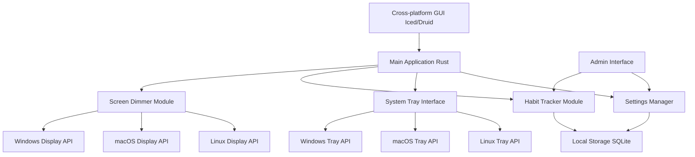

# Architecture

# Architecture Planning Checklist

## 1. High-Level Architecture
- [x] Created overall system diagram
- [x] Identified main components (Screen Dimmer, Habit Tracker, System Tray Interface, etc.)
- [x] Defined interactions between components

## 2. Cross-Platform Considerations
- [x] Identified platform-specific modules (Display API, Tray API)
- [x] Chosen cross-platform GUI framework (e.g., Iced/Druid)
- [ ] Detailed plan for handling platform-specific code

## 3. Data Flow
- [ ] Defined data flow between components
- [ ] Specified data persistence strategy (e.g., SQLite)

## 4. Module Specifications
- [ ] Detailed specifications for each major module
- [ ] Defined interfaces between modules

## 5. Technology Stack
- [x] Chosen primary language (Rust)
- [ ] Selected specific libraries and frameworks for each component

## 6. Security Considerations
- [ ] Identified potential security concerns
- [ ] Outlined strategies for secure data storage and handling

## 7. Performance Considerations
- [ ] Identified potential performance bottlenecks
- [ ] Outlined strategies for efficient background running

## 8. Scalability and Extensibility
- [ ] Planned for future feature additions
- [ ] Designed for easy maintenance and updates

## 9. Error Handling and Logging
- [ ] Defined error handling strategy
- [ ] Planned logging and debugging features

## 10. Testing Strategy
- [ ] Outlined approach for unit testing
- [ ] Planned for integration and cross-platform testing

## 11. Documentation
- [ ] Created initial architecture documentation
- [ ] Planned for ongoing documentation updates

# Pre-Development Tasks

## 1. Module Specifications
- [ ] Define the Screen Dimmer Module
  - Specify how it will interact with OS-specific APIs
  - Outline the dimming logic and customization options
- [ ] Detail the Habit Tracker Module
  - Define data structures for habits
  - Specify CRUD operations for habits
- [ ] Specify the System Tray Interface
  - List available actions and their implementations
- [ ] Outline the Settings Manager
  - Define configurable options
  - Specify how settings will be stored and retrieved

## 2. Technology Stack
- [ ] Choose a cross-platform GUI framework (e.g., Iced, Druid, or egui)
- [ ] Select libraries for OS-specific operations:
  - Screen dimming (Windows, macOS, Linux)
  - System tray integration
- [ ] Choose a database solution (e.g., SQLite, sled)

## 3. Data Flow
- [ ] Create a data flow diagram
  - Show how data moves between modules
  - Identify where data is stored and retrieved
- [ ] Define the data persistence strategy
  - Specify how and when data is saved
  - Plan for data migration and upgrades

## 4. Initial Error Handling Strategy
- [ ] Define a basic approach to error handling
- [ ] Decide on a logging strategy for debugging

## 5. Basic Testing Approach
- [ ] Outline a strategy for unit testing critical components
- [ ] Plan for cross-platform testing basics

# Rust Cross-Platform Development Heuristics

## 1. Cross-Platform GUI
- Use frameworks like Iced, Druid, or egui
- Write most UI code once for all platforms

## 2. System-Level Interactions
- Utilize platform-specific APIs:
  - Windows: `winapi` crate
  - macOS: `cocoa` crate
  - Linux: `x11` crate
- Implement conditional compilation for platform-specific code

## 3. Build Process
- Leverage Cargo's cross-compilation support
- Set up different build targets for each platform

## 4. Testing
- Conduct thorough testing on each target platform
- Ensure consistent behavior across all platforms

## 5. Development Strategy
- Consider starting with one platform for initial development
- Gradually expand to other platforms
- Design with platform abstraction in mind from the start
- Maximize shared, platform-independent code
- Minimize platform-specific code

## 6. Data Storage
- Use cross-platform solutions like SQLite for local storage

## 7. Architecture
- Implement a modular design with clear separation of concerns
- Use trait-based abstractions for platform-specific functionality
- Create a core library with shared business logic

## 8. Dependency Management
- Carefully select dependencies with cross-platform support
- Be prepared to fork and modify dependencies if necessary

## 9. Continuous Integration
- Set up CI pipelines to build and test on all target platforms
- Automate cross-platform builds to catch issues early

## 10. Documentation
- Clearly document platform-specific considerations
- Provide setup instructions for each supported platform
