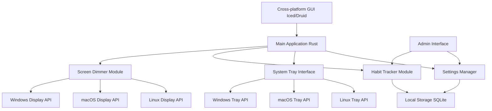

# Architecture

# Rust Cross-Platform Development Heuristics

## 1. Cross-Platform GUI
- Use frameworks like Iced, Druid, or egui
- Write most UI code once for all platforms

## 2. System-Level Interactions
- Utilize platform-specific APIs:
  - Windows: `winapi` crate
  - macOS: `cocoa` crate
  - Linux: `x11` crate
- Implement conditional compilation for platform-specific code

## 3. Build Process
- Leverage Cargo's cross-compilation support
- Set up different build targets for each platform

## 4. Testing
- Conduct thorough testing on each target platform
- Ensure consistent behavior across all platforms

## 5. Development Strategy
- Consider starting with one platform for initial development
- Gradually expand to other platforms
- Design with platform abstraction in mind from the start
- Maximize shared, platform-independent code
- Minimize platform-specific code

## 6. Data Storage
- Use cross-platform solutions like SQLite for local storage

## 7. Architecture
- Implement a modular design with clear separation of concerns
- Use trait-based abstractions for platform-specific functionality
- Create a core library with shared business logic

## 8. Dependency Management
- Carefully select dependencies with cross-platform support
- Be prepared to fork and modify dependencies if necessary

## 9. Continuous Integration
- Set up CI pipelines to build and test on all target platforms
- Automate cross-platform builds to catch issues early

## 10. Documentation
- Clearly document platform-specific considerations
- Provide setup instructions for each supported platform
