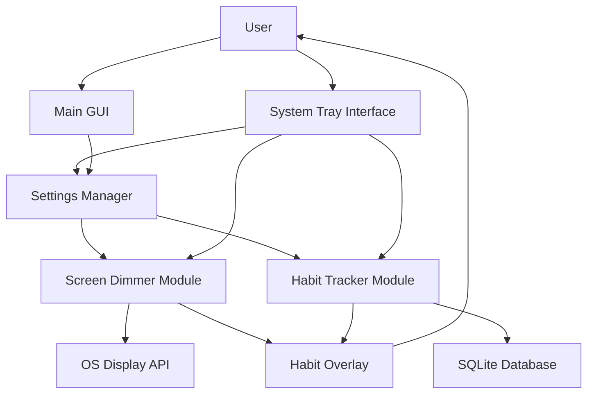

# Data Flow Description

1. User Interaction
   - Users interact with the application primarily through the System Tray Interface and the Main GUI.
   - The System Tray Interface provides quick actions and status updates.
   - The Main GUI allows for more detailed interaction with habits and settings.

2. Settings Management
   - Both the System Tray Interface and Main GUI interact with the Settings Manager to retrieve and update user preferences.
   - The Settings Manager stores data in a configuration file (JSON format).
   - It provides settings to other modules as needed.

3. Screen Dimmer Module
   - Receives configuration (break interval, duration, opacity) from the Settings Manager.
   - Interacts with the OS Display API to control screen dimming.
   - Notifies the Habit Tracker Module when a break starts, triggering the habit overlay.
   - Can be controlled (e.g., skip break, pause/resume) via the System Tray Interface.

4. Habit Tracker Module
   - Stores and retrieves habit data using the SQLite Database.
   - Receives user input for creating, updating, and deleting habits from the Main GUI.
   - Provides habit data to the Habit Overlay during screen breaks.
   - Can be quickly accessed (e.g., mark habit as complete) via the System Tray Interface.

5. Habit Overlay
   - Displays current habit status during screen breaks.
   - Receives data from both the Screen Dimmer Module (break timing) and Habit Tracker Module (habit information).
   - Allows minimal user interaction (e.g., marking habits as complete) during breaks.

6. Data Persistence
   - Settings are stored in a JSON configuration file, managed by the Settings Manager.
   - Habit data is stored in a SQLite database, managed by the Habit Tracker Module.

7. OS Interaction
   - The Screen Dimmer Module interacts with the OS Display API to control screen brightness/opacity.
   - The System Tray Interface interacts with the OS to display the tray icon and menu.

## Key Data Flows

1. User Preferences Flow:
   User -> Main GUI/System Tray -> Settings Manager -> Configuration File

2. Habit Data Flow:
   User -> Main GUI/System Tray -> Habit Tracker Module -> SQLite Database

3. Break Timing Flow:
   Settings Manager -> Screen Dimmer Module -> OS Display API

4. Habit Display Flow:
   Habit Tracker Module -> Habit Overlay -> User

5. Break Trigger Flow:
   Screen Dimmer Module -> Habit Tracker Module -> Habit Overlay

## Considerations for Clean Architecture

1. Dependency Inversion: Core modules (Screen Dimmer, Habit Tracker) should depend on abstractions, not concrete implementations of OS APIs or databases.

2. Single Responsibility: Each module has a clear, focused purpose.

3. Open/Closed Principle: Modules are open for extension (e.g., adding new habit types) but closed for modification.

4. Interface Segregation: Provide specific interfaces for different functionalities (e.g., separate trait for dimming and for break timing in Screen Dimmer Module).

5. Testability: This architecture allows for easy mocking of dependencies, facilitating unit testing.