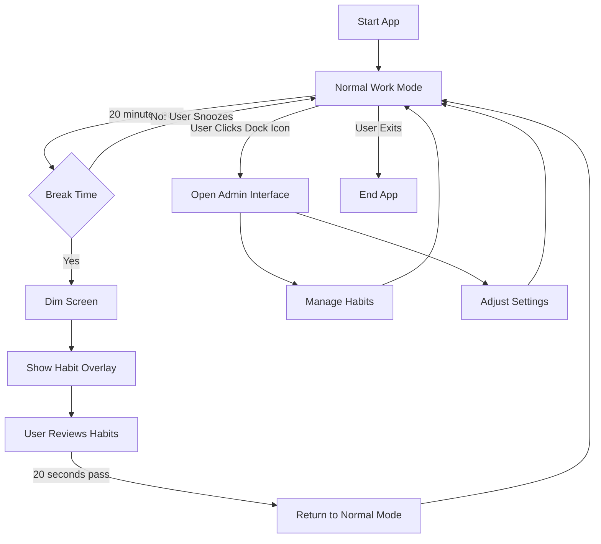

# Ux Design 

# Flow

```mermaid
graph TD
    A[Start App] --> B[Normal Work Mode]
    B --> |20 minutes pass| C{Break Time}
    C --> |Yes| D[Dim Screen]
    D --> E[Show Habit Overlay]
    E --> F[User Reviews Habits]
    F --> |20 seconds pass| G[Return to Normal Mode]
    G --> B
    C --> |No: User Snoozes| B
    B --> |User Clicks Dock Icon| H[Open Admin Interface]
    H --> I[Manage Habits]
    H --> J[Adjust Settings]
    I --> B
    J --> B
    B --> |User Exits| K[End App]
```
